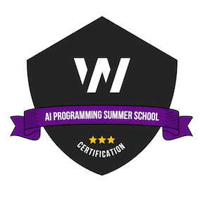

# AI Programming Summer School 2024

  

During the summer months (June-July) 2024 I participated in an AI programming summer school created by [Workealry](https://www.workearly.gr/). The course included programming concepts using the Python programming language. Such as data visualization, OpenAI API integration and Streamlit development to create data applications. In addition, there were assignments that combined all the knowledge gained in order to create practical application projects using Python with OpenAI, demonstrating the ability to apply AI programming skills to real-world scenarios. This repository consists of the 4 projects we were asked to develop during the course. More info about the tasks:

 1. **Task 1:** Data Analysis (A data analysis jupyter notebook)
 2. **Task 2:** Financial Analysis tool ( A Streamlit application which uses Open AI API under the hood in order to 		     compare stocks)
 3. **Task 3:** Disease Analysis (A Streamlit application which uses Open AI API under the hood in order to predict your disease, depending with your symptoms)
 4. **Task 4** Quiz Generator (A Streamlit application which uses Open AI API under the hood in order generate quizzes dynamically)
